# The Data Behind Tyrese Maxey's Breakout Season
----

##### *By Max Orenstein*

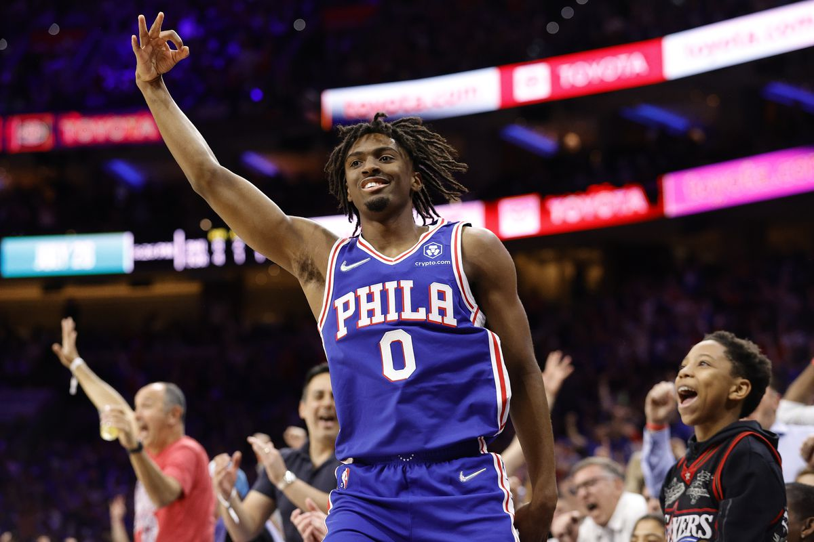

### Introduction

Tyrese Maxey was drafted by the Philadelphia 76ers with the 21st pick in the 2020 NBA Draft. Coming out of college critics questioned his poor three point shooting in college and his injury prone past. However just four years into his NBA career he is an all star candidate on a top championship contender and one of the best young prospects in the league. Maxey's game has seen progression every year of his career but this season in particular he has broken out into the top flight of NBA point guards. The departure of former MVP point guard James Harden from the Sixers has opened the gap for Maxey to be the Sixer's clear number two offensive option behind current MVP Joel Embiid, and he has taken advantage. In this project we will analyze Tyrese Maxey's growth in offensive metrics throughout his career with particular focus on his improvement in productivity and efficiency, shooting, dribbling and passing, pace of play, and team impact. We will use numbers, graphics, and narrative angles to the story of his rise to stardom and explain what's going on under the hood.

----

#### Data sources:

Our data are mainly these two websites:

1. https://www.nba.com/stats
2. https://www.basketball-reference.com/

----

### Glossary

1. Assist: A pass leading directly to a score by a teammate.
2. Athletic Skillset: The physical abilities and talents of a player, like speed, strength, and agility.
3. Dribble Handoff: An offensive play where a player dribbles towards a teammate and hands off the ball to them.
4. Driving Layup: A close-range shot where a player drives towards the basket and lays the ball up into the hoop.
5. Efficiency: The effectiveness with which a player or team utilizes their opportunities in a game, often measured in terms of shooting percentages and points per possession.
6. Free Throw: An unopposed attempt to score from the free-throw line, awarded after certain fouls.
7. Midrange: Shots taken from an intermediate distance, typically between the paint and the three-point line.
8. Off the Dribble: A shot taken directly after dribbling, without stopping to set up the shot.
9. Pace of Play: The speed at which a team plays, typically measured in possessions per game.
10. Point Guard: A position typically responsible for organizing the team's offense, bringing the ball up the court, and distributing it to teammates.
11. Possession (First Team): The initial control of the ball in a game or a specific play, often determined by a tip-off or inbound.
12. Post-Up Game: Offensive play where a player receives the ball in the post (near the basket) and uses their body to create a scoring opportunity.
13. Pull Up Jumper: A jump shot taken after a player abruptly stops their dribble.
14. Running Layup: A shot where a player lays the ball into the hoop while in motion, usually during a fast break.
15. Secondary Scorer: A player who provides significant scoring behind the team's primary scoring option.
16. The Arc: The three-point line that arcs around the radius of the basket.
17. The Key: The painted area near the basket, also known as the lane or paint.
18. Three Point: A shot made from beyond the three-point line, worth three points.
19. Transition Game: The aspect of the game focused on moving quickly from defense to offense.
20. Turnover: Losing possession of the ball to the opposing team, due to a mistake or violation.
21. Two Point: A shot made from inside the three-point line, worth two points.
----

### General Impression

#### Productivity and Efficiency

**Tyrese Maxey is becoming unstoppable this season!** If Tyrese Maxey was a rising star last season, he's now like the team's go-to guy. Maxey is killing it on the court, playing an awesome **38.4 minutes** per game and scoring an incredible average of **27.0 points**, **6.7 assists**, **4.6 rebounds**, **0.8 steals**, and only making **1.6 turnovers** per game.

Maxey's game has hit new heights, with almost every stat reaching his personal best, especially his points and assists.

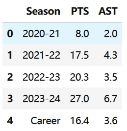

Maxey in general has a very advanced position among all the players in the league. The chart below illustrates Maxey's league position in both points and assists per game, showcasing his elite standing among NBA players.The nearer to the upper-right point, the better basic offensive data the player has.  Only Trae Young, Luka Doncic, and Nikola Jokic outshine him in both categories. Impressive, considering Maxey is the second-in-command on his team, while the others are the primary stars.

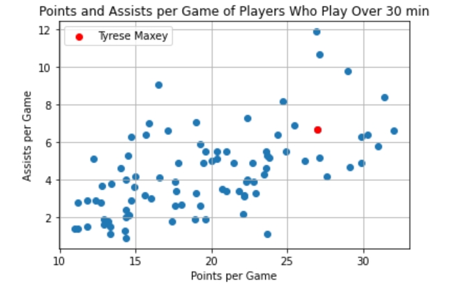

While his data explodes, let's dig into Maxey's game and see how **efficient** and **effective** he's been.. 

Maxey's shooting percentage dropped a bit, but it's okay because he's taking more shots. The relentless physicality and heightened defensive pressure naturally impact shooting percentages

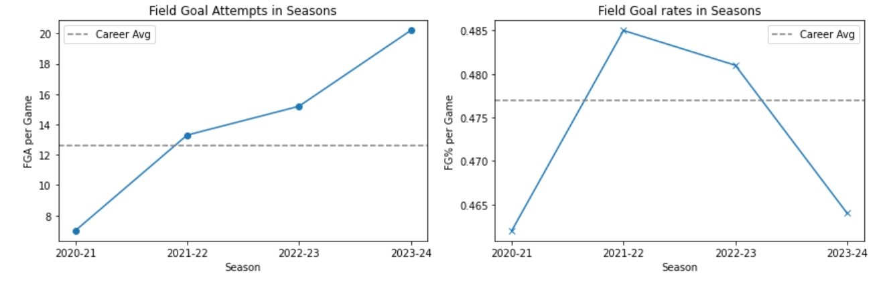

In the realm of true shooting percentage, Maxey boasts an impressive **59.6%**, well above the league average of **54.3%**. This metric considers both 3-pointers and free throws, showcasing Maxey's ability to convert every attempt into an average of **1.192 points**. A commendable feat!

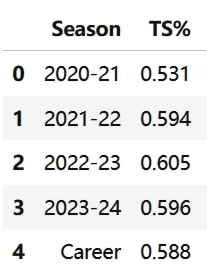 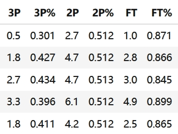

Maxey's evolution is evident in his increased attempts: **3.3 three-pointers**, **6.1 two-point shots**, and **4.9 free throws per game**. Although hit rates show a slight decrease, his **39.6% 3-point accuracy** , **51.2% 2-point accuracy** and an **89.9% free throw percentage** (a **quasi-180-club** performance!) still underscore his growing shooting prowess.

Maxey's dynamic playing style emerges as he embraces **more 3-point attempts** and aggressive drives to the basket (**more free throws earned**) - a testament to his adaptability in sync with the modern "Moneyball Theory."

Exploring deeper into Maxey's productivity, we can use **usage percentage** to present a more comprehensive image. Usage percentage is the number of possessions a player uses per 40 minutes. 
* *{[FGA + (FT Att. x 0.44) + (Ast x 0.33) + TO] x 40 x League Pace} divided by (Minutes x Team Pace)* 

Examining Usage Percentage gives us an indication of how efficient a player is given the amount of possessions he uses. What defines a quality player is someone who can have a high Usage Percentage, but still plays at a high rate of efficiency.

As to Maxey, his usage percentage climbs season after season, reaching a formidable **26.6%** this year. In a league where offense is king, Maxey emerges as a relentless offensive force, contributing to over a quarter of his team's scores during his **38.4-minute** marathon on the court.

The chart below shows Maxey's position in both usage percentage and true shooting percentage in the league. As a player who has a high usage percentage (means how much the team relies on him), his true shooting percentage (means how effective he is) is still above the average of that in the whole league(0.543). In the grand scheme, Maxey's high usage percentage and stellar true shooting percentage position him as a dual threat—shouldering offensive responsibilities with grace and efficiency.

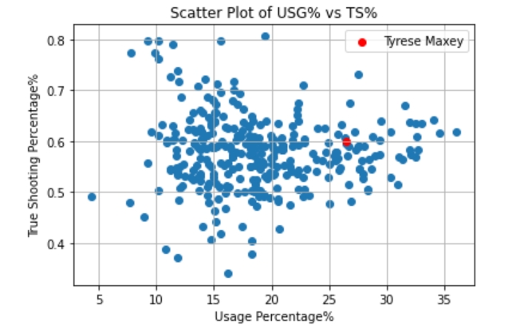

#### Game Influence

To truly grasp Tyrese Maxey's influence on the game, we turn to an advanced metric called BPM - Basketball Box Plus/Minus.

Box Plus/Minus, Version 2.0 (BPM) is a **basketball box score-based metric** that estimates a basketball player's contribution to the team when that player is on the court. It is based only on the information in the traditional basketball box score--no play-by-play data or non-traditional box score data (like dunks or deflections) are included.

BPM uses a player's box score information, position, and the team's overall performance to estimate the player's contribution in points above league average per 100 possessions played. BPM does not take into account playing time -- **it is purely a rate stat**!

League average is defined as 0.0, meaning 0 points above average or below average. Because above-average players play more minutes, there are far more below-average players than above-average players in the league at any time. A value of +5.0 means the team is 5 points per 100 possessions better with the player on the floor than with average production from another player.

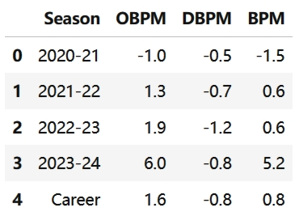

In the chart above, we have OBPM (Offensive BPM) and DBPM (Defensive BPM). Maxey's game impact has soared this season, jumping from **0.6** last year to an impressive **5.2**. To put it in perspective, his BPM ranks **14th in the entire league**. Now, let's break down what these numbers mean:

* +10.0 is an all-time season (think peak Jordan or LeBron)
* +8.0 is an MVP season (think peak Dirk or peak Shaq)
* +6.0 is an all-NBA season
* +4.0 is in all-star consideration
* +2.0 is a good starter
* +0.0 is a decent starter or solid 6th man
* -2.0 is a bench player (this is also defined as "replacement level")
* Below -2.0 are many end-of-bench players

Maxey's offensive BPM is an impressive **6.0**, placing him among **the top 8 OBPM players in the NBA**. On the flip side, his defense, with a DBPM of only **-0.8**, doesn't contribute positively to the team. Given Maxey's shorter height and less physical build, his defense isn't expected to be a strong suit. However, his dazzling offensive performance often overshadows any defensive shortcomings. It's worth noting that Maxey is even improving his defense, moving from **-1.2 last year** to **-0.8 this season**.

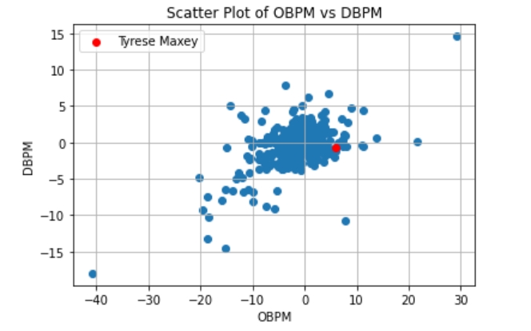

Looking at the league chart of OBPM and DBPM, Maxey's position aligns with our observations—an offensive powerhouse with a relatively weaker defensive stance. Essentially, Maxey is a lethal weapon in the league. Despite any defensive drawbacks, his offensive prowess stands as a pillar for any team, significantly elevating the team's capabilities.

----

### Shooting Analysis

The biggest knock on Tyrese Maxey coming out of college was his poor three point shooting coming out of college. In today's NBA a 29.2% three point percentage is unacceptable from a starting point guard no matter his other attributes. Nevertheless, the Sixers took a gamble on the young Kentucky guard, and four years in this is how his shooting has progressed.

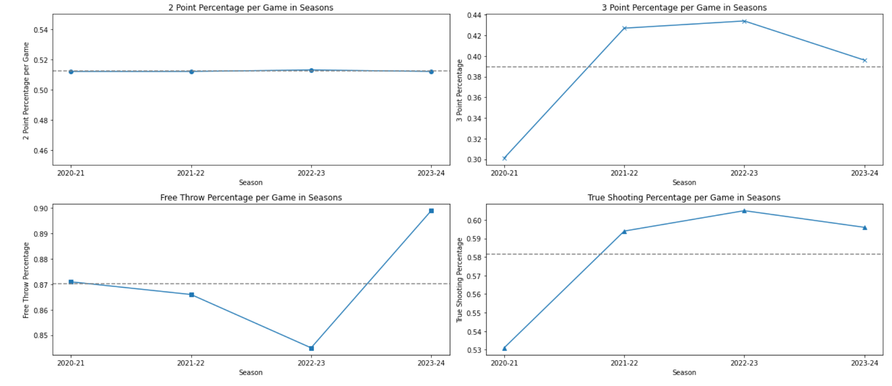

The growth in his three point shooting was dramatic from his Rookie to Sophmore campaign in the NBA. Going from one of the worst three point shooting guards in the league to living in the elite 40%+ range ever since. This year he has actually regressed a bit in three point shooting percentage, likely due to the teams higher reliance on his skills which causes him to take more contested and difficult shots. Another takeaway is that while his two point percentage has been relatively stable throughout his career this year it has skyrocketed to over 90%. This could help explain his improvement this year, since the increased efficiency from the line corresponds to opponents focusing more on stopping him and drawing more fouls. However, Maxey's progression has been more nuanced than these cumulative numbers. Maxey's shot selection data tells a different story about which types of shots he is most efficient at, and how these numbers have changed across his career.

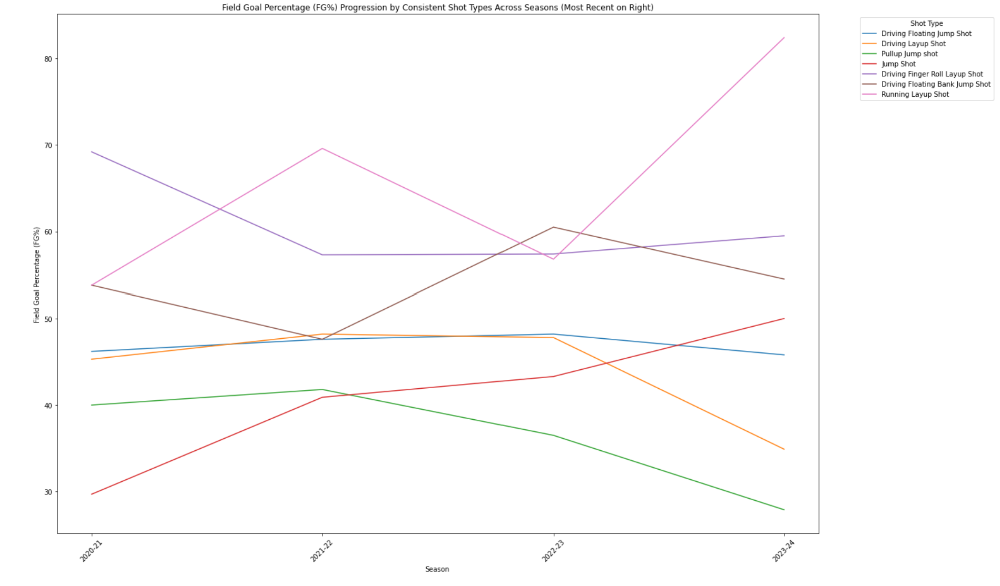

From the shot selection data we can see that Maxey's running layup is his best shot this year, converting at a stunning efficiency. This could be due to his scoring in transition and his dribble handoff plays he's ran with Embiid this season. His jump shot efficiency has also steadily improved since entering the league, whereas his driving layup and pull up jumper have regressed a bit this year. This data tells us what sort of shots Tyrese Maxey is improving, but it doesn't tell us much about where he's improving from. His shot charts throughout his career can help us explore where these shots were coming from and  where on the floor this improvement was happening.

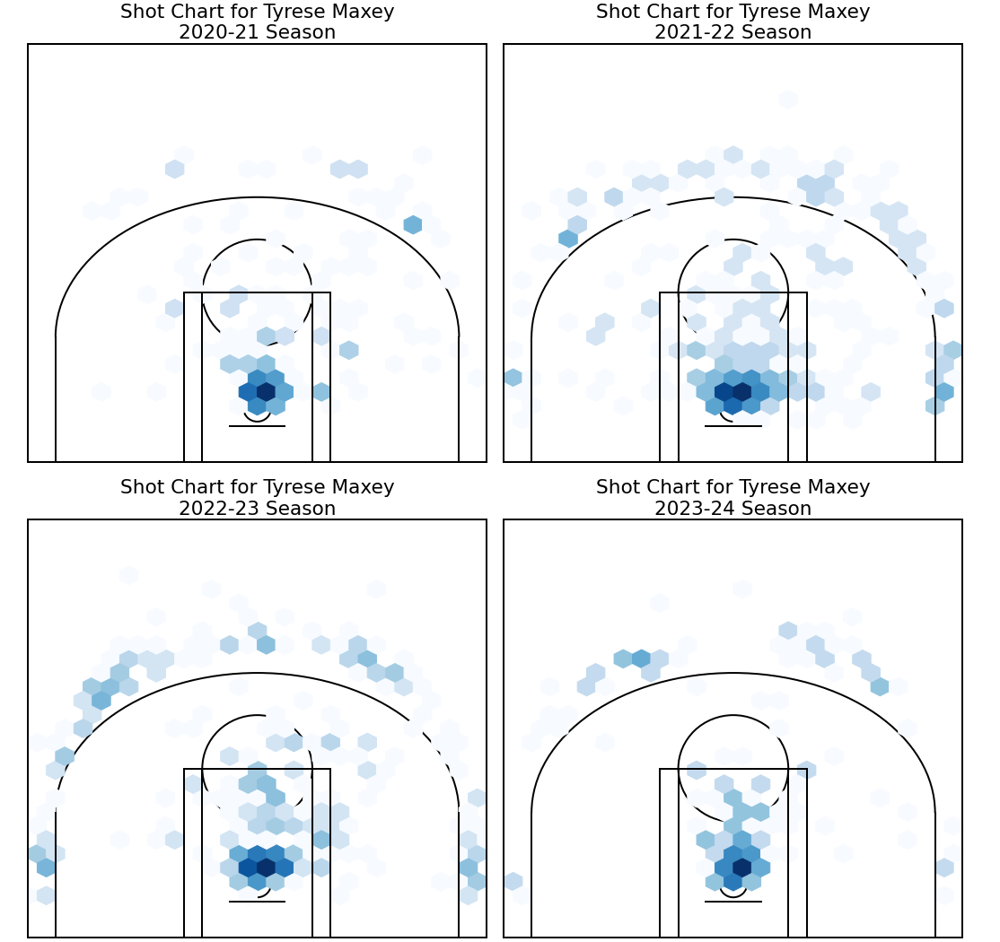

Comparing Maxey's rookie season to his fourth year in the league (with a similar number of games) the added wrinkles to his game are obvious. The threes are coming from the middle left and middle right of the arc and his finishing inside the key is coming from more different spot rather than right under the rim. Notably absent throughout the charts are areas of scoring in the midrange. His low efficiency shooting off the dribble with his pull up jumper and his lack of a post up game are likely contributors. However, the overall diversity of scoring options are making him more difficult to guard and unpredictable with the ball in his hands. In years two and three the corner threes and range of areas in the paint are more pronounced, and this year you can see the beginnings of those same patterns emerging again. 

-----

### Dribbling and Passing

In the realm of Tyrese Maxey's skills, let's break down his dribbling and passing game, focusing on the numbers that truly tell the story.

We've previously noted that Maxey's assist numbers are on a steady rise each year, indicating his growing playmaking abilities. To dive deeper into his passing skills, we need to consider both assists and turnovers, especially in comparison to other league players.

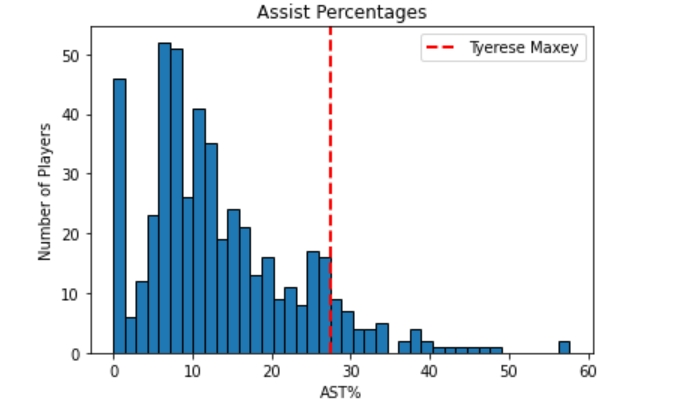 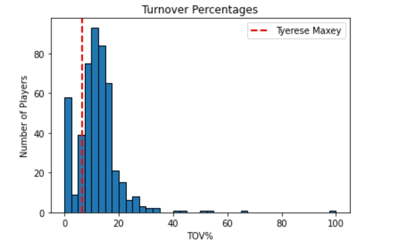

**Assist percentage** is an estimate of the percentage of teammate field goals a player assisted while he was on the floor. The formula is 100 * AST / (((MP / (Tm MP / 5)) * Tm FG) - FG). **Turnover percentage** is an estimate of turnovers per 100 plays. The formula is 100 * TOV / (FGA + 0.44 * FTA + TOV). In short, these two variables can reflect one's assist level and turnover rate in a scientific way.

Looking at the chart, despite Maxey's increased playmaking role, he manages to control turnovers exceptionally well, surpassing the league average. This suggests that not only is Maxey creating opportunities for teammates, but he's doing so with remarkable efficiency and precision.

Assist and turnover percentages provide a scientific lens to evaluate Maxey's passing performance. The chart below showcases Maxey's ability to maintain a high assist percentage while keeping turnovers in check, a sign of excellent passing skills.

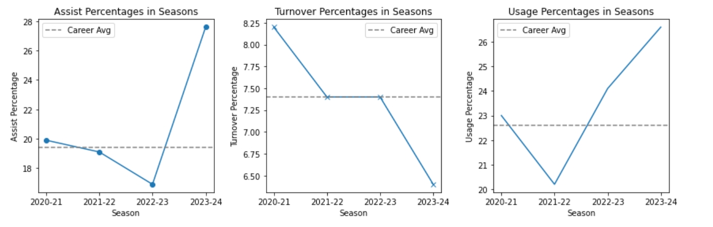

As usage percentage goes up, players typically face a higher turnover percentage due to increased responsibilities. However, Maxey has defied this trend throughout his career. He has not only boosted his assist percentage and usage percentage significantly but has also slashed the turnover percentage. This kind of progress is not just commendable; it's exceptional. Maxey's potential in dribbling and passing is on a trajectory that's hard to measure, and he's already proven himself as a reliable source of attack.

----

### Pace of Play

Tyrese Maxey's transition to guard this season has been a transition for the team as a whole. Along with the signing of new coach Nick Nurse, the Sixers have placed emphasis on speeding up the pace of play on offense from one of the slowest in the league last season. And this was successful, the post Harden Sixers are playing at a significantly faster pace than before.

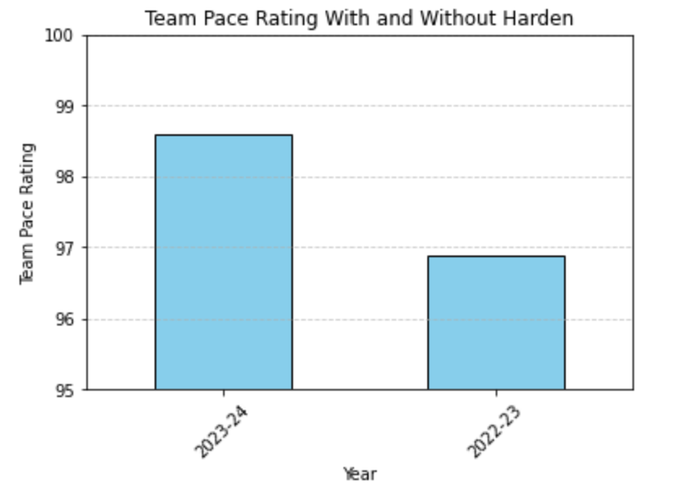

This increase of pace post Harden can be attributed partially to a coaching change, but also the change in personnel. Tyrese Maxey's unique athletic skillset is more akin to this style of play. Data on his distance covered and average speed per game shows why this may be so.

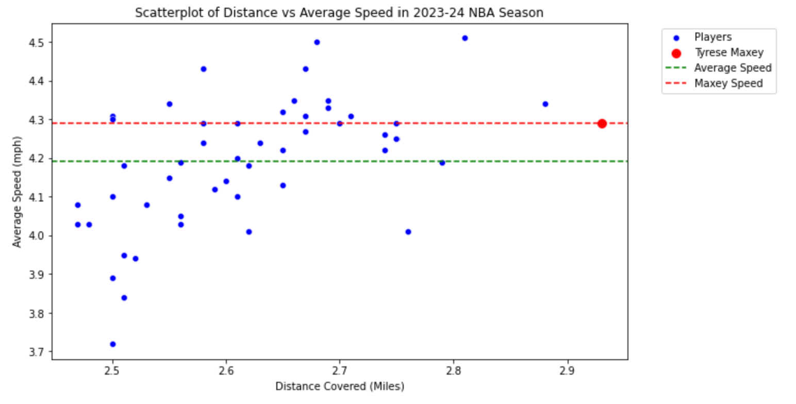

Maxey is leading the league in distance covered, separating himself even from other league leaders. And not only is he running a lot, he's doing it quickly compared to the other high distance covering NBA players. These unique athletic traits can explain why moving him into the point guard role after Harden departed may have resulted into the pace increase that was seen. With such a young talented player running so much and so fast throughout a game, the coaching and team around him will pick up their speed to complement him. This has resulted in a new frontier for the sixers offense: the transition game. And statistically, Maxey has been a league leader in that this year too. 

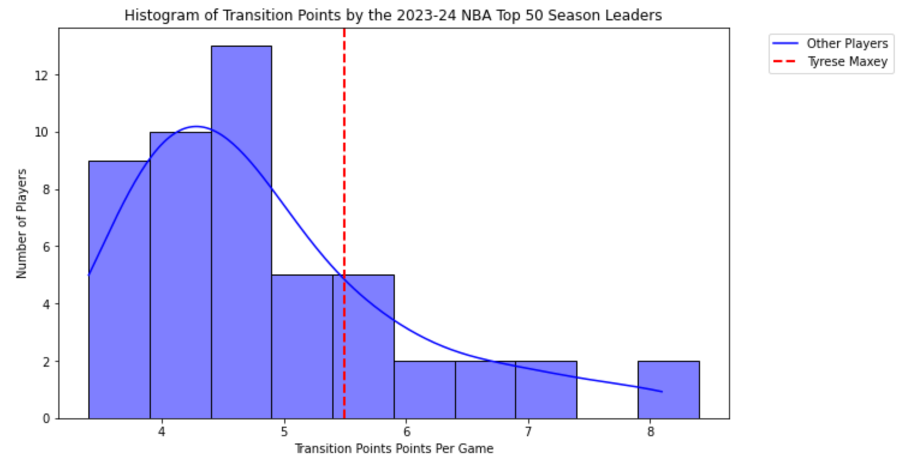

Maxey's transition points per game are impressive compared to the distribution of top 50 players in the league. While he is not quite at the top of the league his numbers are impressive for a secondary scorer on a possession first team that runs through the league MVP. Before Harden this transition game barely existed, and now with Maxey it's another weapon in the team's arsenal.

----

### Two-man game with Joel Embiid

Since the departure of former MVP James Harden, the 76ers have found a new pairing powerhouse in the form of Joel Embiid and Tyrese Maxey. Maxey, transitioning from a shooting guard to a **point guard role** this season, has seamlessly joined forces with the 7-foot-tall, sharp-shooting center, forming a classic and deadly duo that strikes fear into their opponents.

Maxey and Embiid stand out as the linchpins of the 76ers' most frequently used 5-man lineups, playing the most minutes and games together. This duo, known as the **Embiid-Maxey pair**, has a generally positive impact on the team. In their most frequent lineup, they secure an average lead of **7.7 points** during their **13.8-minute** play per game.

Interestingly, the coach seems to prefer having Maxey and Embiid on the court together, as evidenced by their high usage rate in 5-man lineups. When playing without Embiid, the team's performance is less impressive. The most frequent lineup where **Maxey plays without Embiid** **lost 7.3 points in average during their 5.8-minute play per game**. It indicates the coach's strategic choice to deploy them together. 

In terms of 2-man lineup, surprisingly, Embiid and Maxey is only the **5th most-time pair** in 76ers. Despite not being the most frequent pairing, Embiid and Maxey boast the **highest offensive rating, net rating, and player impact estimate** among the top five most-used pairs. This dynamic duo consistently delivers stability and efficiency, making them a reliable force on the court.

While Batum emerges as a valuable offensive role player for the 76ers, the Embiid-Maxey duo remains the most dependable even in his absence. Batum's exceptional shooting percentages highlight his contribution, but the sample size is small, making it premature to crown him as the team's best offensive player. As a 3D player (3-point and defense), Batum has a wonderful performance recently, way above his average, which means he perhaps cannot keep this efficiency through the whole season.

The Embiid-Maxey partnership is not just a statistical success; it's a game-changer for the 76ers. Despite their ranking as the **66th most-used pair** in the league, their **offensive rating** and **player impact estimated** are undeniably advanced.

* Offensive proficiency rating is a statistic used in basketball to measure either a team's offensive performance or an individual player's efficiency at producing points for the offense. Offensive Production Rating = (Points Produced / Individual Possessions) x OAPOW × PPG + FTM/FT * 3pt% + FG%
* Player Impact Estimate (PIE) is a simple metric that seeks to give an indication of performance at both the team and player level. It measures a player’s overall statistical contribution against the total statistics in games they play in. (PTS + FGM + FTM – FGA – FTA + DREB + (.5 * OREB) + AST + STL + (.5 * BLK) – PF – TO) / (GmPTS + GmFGM + GmFTM – GmFGA – GmFTA + GmDREB + (.5 * GmOREB) + GmAST + GmSTL + (.5 * GmBLK) – GmPF – GmTO)

**Let's break down the specific collaborations of the Embiid-Maxey tandem.**

#### Pick-and-Roll: Roll Man, Screen Assists and Handoffs

Similar to the previous formidable duo of James Harden and Joel Embiid, Tyrese Maxey and Joel Embiid engage in a variety of plays, particularly utilizing pick-and-roll actions in their two-man game.

Maxey significantly dominates the ballhandling plays for the 76ers, accounting for more than half of the total possessions at **8.8 times** per game out of a **team total of 16.6**. While Maxey has a high **frequency of ballhandler plays at 37.3%**, his efficiency is slightly lower at **0.93 points per possession** compareda to the team's overall efficiency of **0.95 points per possession**. On the other hand, Embiid excels as the roll man in the pick-and-roll (P&R) play, contributing to **5.4 of the team's 7.9 roll man plays** per game and scoring efficiently with **1.08 points per play**.

The offensive focus of the team remains predominantly on Embiid, and on-court scenarios often unfold as illustrated below:

In this example, Embiid (Number 21) sets a screen for Maxey (the ballhandler in the picture), who then uses his dribbling skills to dismantle the defense. Instead of cutting to the basket, Embiid moves back to the 3-point line. Maxey returns the ball to Embiid, capitalizing on the space created by Maxey's penetration. Embiid, with his exceptional shooting abilities, takes advantage of the open space to contribute to the team's offensive prowess.

Due to the dual offensive threats posed by Embiid and Maxey, opposing defenses struggle to allocate suitable defenders. Embiid's height and shooting prowess, coupled with Maxey's 3-point shooting and speed, make it challenging for opponents to defend effectively. This dynamic creates ample space for both players and their teammates, opening opportunities for set-up 3-point shots and cuts. It's essential to note that, in these scenarios, Embiid remains the primary scoring focal point, while Maxey takes on a more facilitating role as a passer and playmaker.

When Joel Embiid finds limited scoring opportunities, he becomes a key playmaker for his teammates, particularly benefiting Tyrese Maxey. Nearly **half of the team's screen assists (totaling 8.0 assists)** come from Embiid, resulting in **3.7 assists** per game, translating to **8.9 points**. The majority of these screen plays involve 2-point shots (**10.6 attempts per game**), with some also featuring 3-point attempts (**3.0 per game**).

In these scenarios, Maxey cleverly utilizes Embiid's imposing presence as cover. Leveraging his exceptional speed and dribbling skills, Maxey executes classic floaters with ease. The threat of Maxey's passing ability adds an extra layer of complexity for defenders, forcing them to account for potential assists as they defend against his scoring attempts.

Handoff plays provide another avenue for creating opportunities for Embiid's teammates, with Maxey leading in this category. Maxey is involved in nearly **half of the team's total handoff plays**, **surpassing the team average frequency by 2.3 times (Maxey's frequency is 13.4%)**. He demonstrates remarkable efficiency in this play type, generating **1.3 points per play**. Out of the team's **6.8 possessions** involving handoffs, Maxey takes up **3.2** of them.

In these handoff scenarios, Embiid serves as the axis, creating space for Maxey through cutting. Maxey capitalizes on the opportunities provided by Embiid, showcasing a well-rounded offensive skill set that includes mid-range shots, floaters, and efficient scoring from various positions on the court.

In conclusion, Maxey's exceptional speed and versatile attacking skills, as highlighted in previous sections, make him both a lethal scoring weapon and an excellent playmaker for his partner, Embiid. While Embiid remains the primary scoring option, Maxey takes advantage of the defensive attention drawn by Embiid to contribute significantly. Their pick-and-roll plays are a regular and effective weapon, with both players benefiting mutually from each other's skills.

----

### Conclusion

Tyrese Maxey's breakout season paints a vivid picture of growth and versatility, showcasing his evolution into a dynamic point guard and impactful collaborator with Joel Embiid. From offensive prowess to shooting, dribbling, passing, and team dynamics, Maxey's journey marks him as a rising star in the league. Despite playing second fiddle in offense, his efficiency, playmaking, and energy significantly contribute to the team's success. The strategic partnership with Embiid, evident in dynamic plays, solidifies them as a duo that elevates the entire team. Maxey's progress in offense, especially in scoring and playmaking, positions him as a key force in the Philadelphia 76ers' pursuit of a championship. The fans no longer miss former MVP James Harden, thanks to Maxey's dazzling performances and the promise of a championship run.